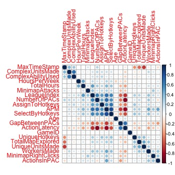

# Introduction
Experimental psychologists and cognitive scientists researching skill acquisition often find themselves limited by temporal and spatial constraints associated with in-person, experimental laboratory work. For example, skill development takes course over long spans of time, and it is often difficult or impossible to track an individuals’ progress from novice to expert for more complex skills. Additionally, laboratory spaces in which novice, intermediate, and expert performance are assessed are often quite dissimilar from the environments in which the skills are typically informed.  

As COVID-19 has temporarily stunted in-person laboratory work with human subjects, researchers are looking for rich sources of data that do not require a laboratory. Although a great deal of research on skill acquisition happens within the sports psychology literature, researchers have recently looked to e-sports as means of studying expertise. One major advantage to this approach is the level of the detail that video game telemetry data is able to provide. That is, metrics that are measured in online gaming are often similar or comparable to the measures that experimental psychologists use in the lab, and often this data is collected over longer timespans. Because of this, video game telemetry data is an exciting, potentially fruitful new avenue for research on skill acquisition.   

Here, I conduct an exploratory data analysis on telemetry data collected from hundreds of Starcraft 2 games. Fortunately, some of the measures in the dataset track closely to measures found in experimental psychology lab set-ups. For example, the data set contains information on Perception-Action-Cycles (PAC) which are screen fixations with at least one movement. In particular the variable “action latency” is the time (in milliseconds) to make an action within a PAC, which is similar to a reaction time measure in experimental psychology methods. For this exploratory data analysis, my guiding question is: what variables are correlated with skill level in Starcraft 2?

# Data

The “Starcraft 2 Replay Analysis” data was found on Kaggle.com and was originally gather at Simon Fraser University. Thompson et al. (2013) used a dispersion threshold algorithm to aggregate screen movements into screen fixations. For some variables, time was recorded in milliseconds; however, for other variables, time was recorded in time stamps in the game where one real second is equal to approximately 88.6 time stamps. For the present exploratory data analysis, all data recorded in time stamps will be converted to real seconds for visualization purposes.  That is, all data visualizations will be in either milliseconds, seconds, minutes, or hours. 

In order to categorize players by skill level, I used each player’s league index. These were coded as : Bronze(1) , Silver(2) , Gold(3) , Platinum (4), Diamond (5) , Master (6) , GrandMaster (7). 	

# Results 

First, I looked at correlations between all of the available variables and then generated a correlation plot that hierarchically clusters the variables according to how positively or negatively correlated they are with one another. I identified Actions per Minute (APM), Number of PACs, Action Latency, Average Gap (in ms) Between PACs, Number of Hot Key Selections, and Total Hours Played as most correlated with skill level. 

Next, I generated bar graphs to visualize the variables mentioned above at different skill levels. Skill level is negatively correlated to Action Latency (r = -0.67) as well as Average Gap (in ms) Between PACs (r = -0.53), and is positively corelated with Actions per Minute (r = 0.72), Number of PACs (r = 0.59), Selections by Hot Keys (r = 0.57), and Total Hours Spent Playing (r = 0.49).
 

# Discussion 

The present exploratory data analysis looked at correlations between gameplay statistics and skill level in Starcraft 2. Several of the variables I looked at map closely to measures that are used in experimental psychology labs. For example, action latency closely resembles reaction time, the number of PACs can be seen as a measure of attentional shifts, and APM is a measure of overall action count. 
	
In studies of skill acquisition, motor sequences that are automatized often tend to occur faster than those that involve mental deliberation or planning. In the data, I found that action latency, or the time to first movement within a PAC, decreases with skill level, which is consistent with previous literature.
	
Although some view the hallmark of expertise to be automaticity, others have argued that higher-level cognitive processes such as attention and planning are also important for skilled behavior. Here, I was able to use Number of PACs as a measure of the number of attentional shifts, and the data reveal that the number of PACs increases with skill level. 
	
Taking the action latency and number of PAC data together, it appears as though both automatic and more deliberate, cognitive processes are associated with higher levels of performance. Given that experts are able to respond more quickly within a PAC, this may allow them to shift attention to the next task more quickly, which may explain why the most highly correlated value with skill is overall Actions per Minute. 

In sum, the exploratory data analysis revealed several variables related to skill level in Starcraft 2 and found that many of the most highly correlated variables were those that resemble measures in more traditional experimental psychology labs. Hopefully, the present exploratory data analysis suggests that looking to video game telemetry data may be a rich source of data for experimental psychologists interested in motor learning and skill acquisition. 

